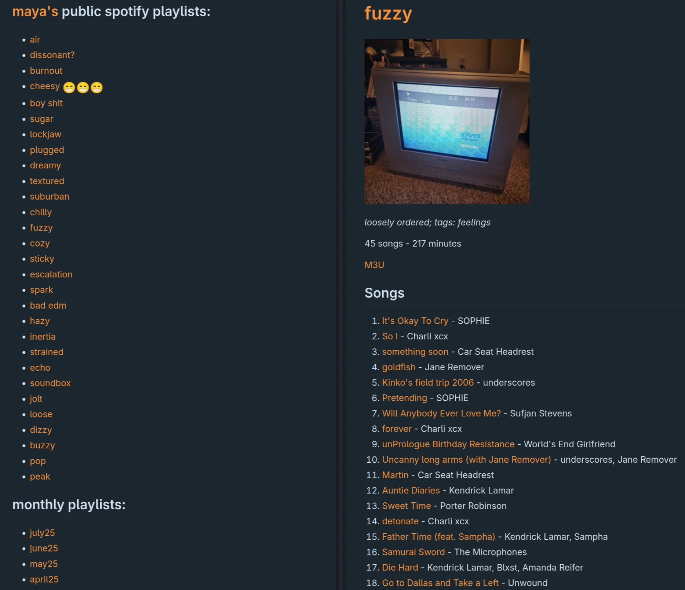

# git-spotify-playlist-history
track spotify playlists with git.

## my repo

## usage:
1. install all dependencies from `requirements.txt`
2. create and clone a blank repo from a remote
3. edit the variables in `consts.py`
4. get spotify api keys from [here](https://developer.spotify.com/dashboard) and add to environment
5. run script on loop somehow (i use a cron job)

### environment variables
- `spotipy_client_id`
- `spotipy_client_secret`

### modification
editing the monthly playlist detection should be trivial just replace
`monthly_playlists` in [utils](utils.py)
